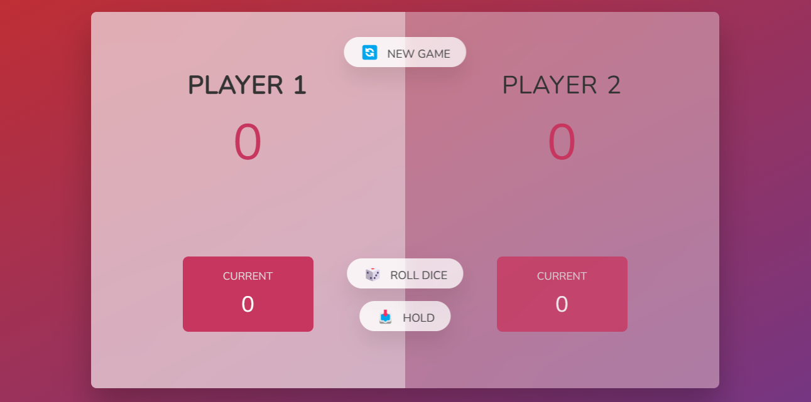
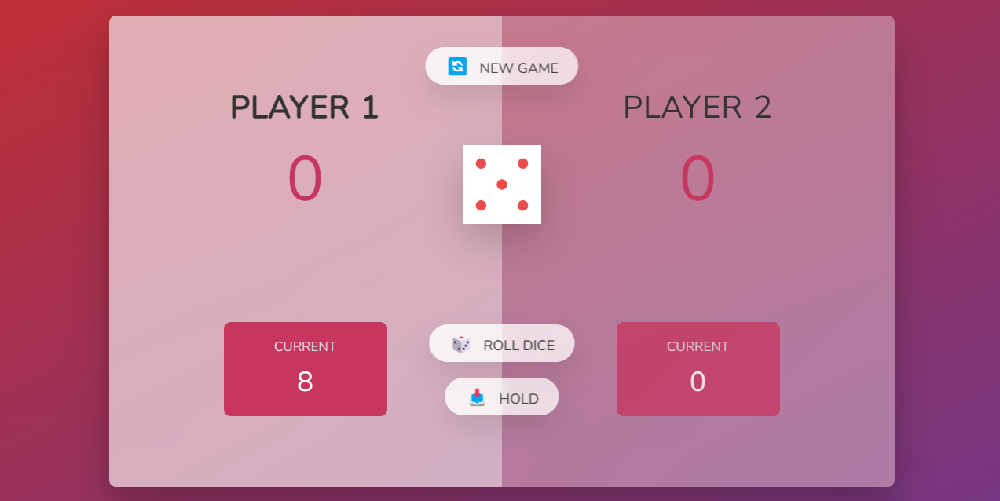

# Dice Dash: Race to 100

Dice Dash is a minimalistic game that requires two players to roll a dice and hold the scores one by one, with the goal of being the first to reach a score of 100.

The game is built using HTML, CSS, and JavaScript, with DOM elements used to create the game board and interface.

## How to Play

To play the game, follow these steps:

1. Open the game in a web browser.
2. Two players take turns rolling a dice by clicking the "Roll Dice" button.
3. After each roll, the player can choose to "Hold" their current score, which adds it to their total score.
4. If a player rolls a "1", their current score is lost and their turn ends.
5. The first player to reach a total score of 100 wins the game.

## Getting Started

To run the game locally, follow these steps:

1. Clone or download the repository to your local machine.
2. Open the index.html file in a web browser.
3. Play the game in the browser.

## Built With

- HTML
- CSS
- JavaScript

## Acknowledgments

This game was created as a project for learning web development skills, including working with DOM elements and JavaScript programming. Thanks to the various online resources and tutorials that helped in the development process.

## ScreenShots

### Dashboard

### Dice Rolled

